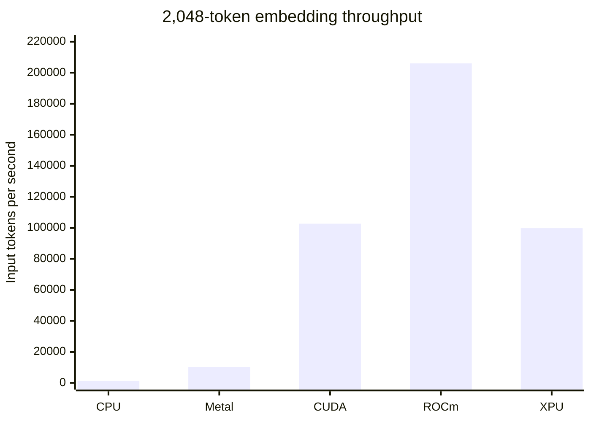

# embeddinggemma.c

**The fastest way to serve EmbeddingGemma. Anywhere.**

Powered by QuixiCore Kernels 

https://github.com/QuixiAI/QuixiCore

https://github.com/QuixiAI/QuixiCore-Metal

`embeddinggemma` is a tiny, model-specialized embeddings server for
EmbeddingGemma 300M. It runs on CPU, Apple Metal, NVIDIA CUDA, AMD ROCm, and
Intel XPU SYCL from a single native executable per platform.

It is fast as fuck, and the CPU binary is about 100 KiB.

- Hand-tuned inference kernels for every supported accelerator family.
- Dynamic batching, bounded queues, duplicate singleflight, and exact-result
  caching for concurrent serving.
- Matryoshka embeddings at 768, 512, 256, and 128 dimensions.
- Automatic model download and a built-in HTTP server on port `42666`.

## Faster than llama.cpp

Measured over HTTP against llama.cpp build b8981 (`llama-server`, Metal) on
an Apple M5 Max: identical GGUF, exact token counts, 768-float outputs, all
caches disabled, both servers restarted fresh for every cell. embeddinggemma
delivers more embeddings per second in **all 54 cells** — geometric mean
**1.25x**, up to 2.01x:

| tokens \ concurrency | 1 | 2 | 4 | 8 | 16 | 32 |
|---:|---:|---:|---:|---:|---:|---:|
| 8 | 1.20x | 1.44x | 1.40x | 1.28x | 1.33x | 1.42x |
| 16 | 1.69x | 2.01x | 1.65x | 1.37x | 1.31x | 1.35x |
| 32 | 1.22x | 1.73x | 1.33x | 1.23x | 1.19x | 1.23x |
| 64 | 1.18x | 1.49x | 1.28x | 1.21x | 1.20x | 1.14x |
| 128 | 1.01x | 1.36x | 1.16x | 1.11x | 1.12x | 1.03x |
| 256 | 1.05x | 1.31x | 1.14x | 1.15x | 1.09x | 1.15x |
| 512 | 1.16x | 1.28x | 1.16x | 1.03x | 1.48x | 1.05x |
| 1,024 | 1.39x | 1.09x | 1.41x | 1.07x | 1.48x | 1.03x |
| 2,048 | 1.39x | 1.05x | 1.40x | 1.02x | 1.44x | 1.04x |

Reproduce with `make perf-compare-llamacpp`; methodology and raw results are
documented in [`perf/`](perf/).

## Basic Usage

Start the server. The correct backend is built into each platform binary and
selected automatically:

```sh
embeddinggemma
```

The model is downloaded on first run to
`${XDG_CACHE_HOME:-$HOME/.cache}/embeddinggemma.c/`.

Create an embedding:

```sh
curl -sS http://127.0.0.1:42666/api/embed \
  -H 'Content-Type: application/json' \
  -d '{
    "model": "embeddinggemma-300m",
    "input": ["task: search result | query: what powers the cell"],
    "dimensions": 256
  }'
```

The response is:

```json
{"embeddings":[[0.0123,-0.0456]]}
```

An additive OpenAI-compatible endpoint is available for gateways and existing
SDKs. The original `/api/embed` contract remains supported:

```sh
curl -sS http://127.0.0.1:42666/v1/embeddings \
  -H 'Content-Type: application/json' \
  -d '{
    "model": "embeddinggemma-300m",
    "input": ["task: search result | query: what powers the cell"],
    "dimensions": 256
  }'
```

The OpenAI response contains the standard `object`, `data`, `model`, and
`usage` fields. The requested model name is echoed so a gateway can use a
stable alias, and `usage` reports the exact number of tokens processed.

`input` accepts one string or an array of strings. Text is embedded exactly as
provided, so include the [EmbeddingGemma prompt prefix](https://ai.google.dev/gemma/docs/embeddinggemma/model_card#prompt_instructions)
for your task: `task: search result | query: {text}` for search queries and
`title: none | text: {text}` for documents. `dimensions` is optional and
may be `768`, `512`, `256`, or `128`; the default is `768`. Reduced Matryoshka
embeddings are normalized again before being returned. Set
`"encoding_format":"base64"` to receive packed little-endian float32 data
instead of JSON float arrays.

Open [http://127.0.0.1:42666/docs](http://127.0.0.1:42666/docs) for the embedded
API reference. `GET /healthz` reports readiness, and `--bind`, `--port`, and
`--model` override the listening address, canonical port, and model path.

## Install

Install the latest release as `~/.local/bin/embeddinggemma`:

```sh
curl -fsSL https://raw.githubusercontent.com/QuixiAI/embeddinggemma.c/main/install.sh | sh
```

The installer detects the host and selects Metal on Apple Silicon or CUDA,
ROCm, XPU, or CPU on Linux x86_64. It verifies the release checksum before
replacing an existing installation and falls back to CPU when an accelerator
runtime is unavailable.

Pin a release, backend, or installation directory when needed:

```sh
./install.sh --version v0.3.1
./install.sh --variant cpu
./install.sh --install-dir "$HOME/bin"
```

Published executables are deliberately small. Release `v0.3.1` contains:

| platform | backend | executable size |
|---|---|---:|
| macOS ARM64 | CPU | 139 KiB |
| macOS ARM64 | Metal | 497 KiB |
| Linux x86_64 | CPU | 106 KiB |
| Linux x86_64 | CUDA | 8.7 MiB |
| Linux x86_64 | ROCm | 1.2 MiB |
| Linux x86_64 | XPU SYCL | 2.1 MiB |

### Fork CI binaries

This fork's `CI` workflow uploads checksummed CPU executable artifacts for
Linux x86_64, Linux ARM64, macOS ARM64, and Windows x86_64 after unit, model,
and HTTP conformance checks pass. Download artifacts from the workflow run;
these are CI builds, not upstream release assets. Existing CUDA, ROCm, XPU
and Metal release targets remain available through the upstream build process.

CPU builds use the compiler's baseline architecture, without `-march=native`:
x86_64 uses SSE2 and ARM64 uses NEON. Linux artifacts are built on Ubuntu 24.04
and require a compatible glibc (2.39 or later); macOS ARM64 is tested on the macOS 15 runner and targets macOS 14 or
later. Windows uses a native MinGW UCRT64 executable with statically linked
winpthreads and compiler runtime, tested on Windows Server 2022. It requires
Windows' Universal C Runtime; older Windows versions are not CI-tested.
No Windows GPU backend or PowerShell installer is provided by this change.

On Windows, run `embeddinggemma-windows-x86_64-cpu.exe`. The default model
cache is `%LOCALAPPDATA%/embeddinggemma.c/`, falling back to
`%USERPROFILE%/.cache/embeddinggemma.c/`; `XDG_CACHE_HOME`, `EI_MODEL_PATH`, and
`--model` retain their existing precedence. Automatic download uses native
`curl.exe` or `wget.exe` on PATH and supports paths containing spaces.
Build locally from an MSYS2 UCRT64 shell with `make check`,
`make test-windows-download`, and `make test` after supplying the public model.
The model's Gemma license is separate from this repository's MIT license.

The 278 MB Q4_0 model is downloaded separately from Hugging Face and is not
distributed by this project.

## Performance

These are warmed median measurements of the complete 300M Q4_0 inference
engine, including token embedding through final pooling and normalization.
They are absolute results from the listed machines, not normalized same-device
backend comparisons.

| backend | tested hardware | 1-token req/s | 32-token tok/s | 2,048-token tok/s |
|---|---|---:|---:|---:|
| CPU | Apple M5 Max | 370 | 1,051 | 1,350 |
| Metal | Apple M5 Max | 570 | 8,009 | 10,465 |
| CUDA | NVIDIA RTX 3090 | 584 | 13,897 | 102,755 |
| ROCm | AMD Instinct MI300X | 1,072 | 8,890 | 206,011 |
| XPU SYCL | Intel Arc Pro B60 | 962 | 14,747 | 99,708 |

At 32-token concurrency, the production scheduler reaches 3,279 req/s on an
RTX 3090, 3,952 req/s on an MI300X, and 3,411 req/s in an explicit batch on an
Arc Pro B60. The MI300X reaches 26,014 req/s for a packed batch of 72 one-token
requests. Long-context throughput peaks at 206,011 input tokens/s.



A same-host comparison against Ollama, vLLM, and Hugging Face
text-embeddings-inference is the next benchmark publication. Those numbers will
use identical prompts, model semantics, warmups, concurrency, and hardware;
cross-project numbers from different machines will not be presented as a fair
ranking. Reproduction commands and all retained/rejected kernel experiments are
documented in [`perf/`](perf/).

## GitHub Stars

[](https://www.star-history.com/#QuixiAI/embeddinggemma.c&Date)

Development setup, backend internals, test requirements, and performance rules
are in [CONTRIBUTING.md](CONTRIBUTING.md). Release builds and artifact
publication are documented in [RELEASE.md](RELEASE.md).
